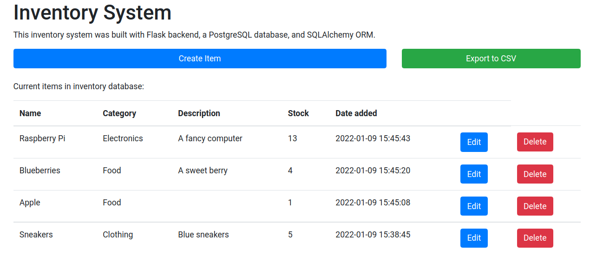

# Shopify Backend Challenge
A CRUD inventory system, built using Flask (Python), PostgreSQL database, and SQLAlchemy ORM. I used Jinja HTML templating for the frontend. 

# Setup

Install `python` (3.8 or higher) and `pip` if you have not already.

Install the required dependencies for the app:
```
pip install -r requirements.txt
```

To start the server, run
```py
python app.py
```


# Architecture
> When building, consider how more features could be added in the future. 

This backend follows the **Model-View-Controller (MVC)** design pattern. In the app we have:
- **Models**: In `Item.py` the inventory table schema is defined with the expected data types for each item object. 
- **Controllers**: In `controllers/itemController.py` handles the actual CRUD operations in SQL and other logic (e.g. converting table into .csv file). We define the API routes in `routes/itemBlueprint.py` which uses Flask's Blueprint feature for modularity. 
- **Views**: The frontend is an Jinja HTML template in `templates/home.html` served by Flask. 

This organization allows for a high degree of modularity and extensibility. For example, if we were to add a user login / authentication feature, we would design a separate model `User.py` containing the relevant schema for a user records table, and `userController.py` for handling the authentication logic. 


# API Documentation

Note: I understand that some APIs prefer to use PUT/PATCH method types for updating and DELETE method type for deleting. However the rudimentary frontend that I built with HTML and Jina templating does not support sending requests with other than GET or POST since PUT/PATCH/DELETE methods are not in the HTML standard. 


## `POST /item/create` 
Create an item from form data. Valid keys/values in the form:
```
name: string
description: string
stock: int
```
Note: when an item is created, we also automatically create an `id` (uuid) and a `date` created associated with the item. 

## `POST /item/update/<itemId>` 

Update the item associated to `itemId` with the form data (same form options as `/item/create`).

## `POST /item/delete/<itemId>` 
Delete an item with the specified itemId. Does not accept any other data. 

## `GET /item/list`
Returns an array of JSON serialized rows for each inventory item.
## `GET /item/export`

Returns a .csv file with the inventory data as a table. 
